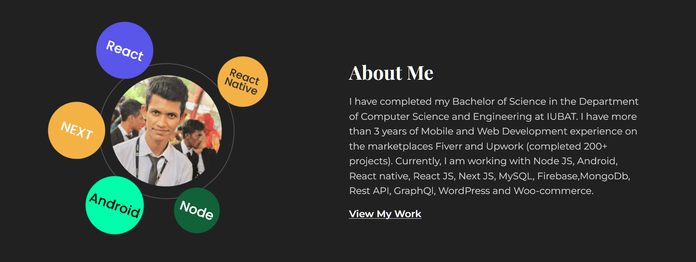

### Hi there 

<!-- Here are some ideas to get you started:

- 🔭 I’m currently working on ...
- 🌱 I’m currently learning ...
- 👯 I’m looking to collaborate on ...
- 🤔 I’m looking for help with ...
- 💬 Ask me about ...
- 📫 How to reach me: ...
- 😄 Pronouns: ...
- ⚡ Fun fact: ... -->

Hi,This is ✨ Md Jahidul Islam Milon✨, I am Mobile(React Native) and Web(Node Js, React Js, Next Js) Developer - available for remote work.

>> ### 📫  How to reach me

>> ### ⚡ I’m currently working on

1. Web Development(full stack)   

1. Mobile Development  

1. Database & ORM  

1. Cloud  

1. Version Control  

>> ### 😄 Few Projects

